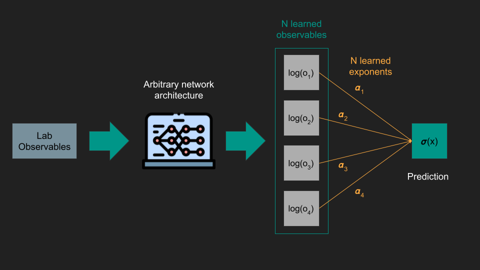

# Optimal Observables

The objective of this project is to use neural networks and symbolic regression to find a closed form expression of a classifier that separates signal and noise on particle physics problems.

**This is a work in progress.**

## Tech Stack
+ [JAX](https://github.com/google/jax)
+ [PyTorch Lightning](https://github.com/Lightning-AI/lightning)
+ [PySR](https://github.com/MilesCranmer/PySR)
+ [Awkward Array](https://github.com/scikit-hep/awkward)
+ [uproot](https://github.com/scikit-hep/uproot5)
+ numpy
+ matplotlib

## Project Description

The main objective is to learn a quantity—which we will call an optimal observable—that is a function of quantities observed experimentally. The idea is to train a neural network with inputs $X$ to classify whether a sample comes from signal or noise while setting $X$ to quantities we can observe experimentally. The neural network then learns a representation that maximizes the separation between signal and noise using only quantities we can observe.

We assume multiplicative optimal observables $o = \prod \tau^{\alpha}$ which can be written as $\log(o) = \sum \alpha \log(\tau)$. The last expression is equivalent to the last layer of a neural network where $\log(\tau)$ are the representations learned by the network on the second to last layer and optimally classify samples. $\alpha$ are the weights on the last layer, and $o$ is the output neuron before applying the sigmoid function. Since $o$ is the output for the classifier, we train it to maximize separation between the classes corresponding to noise and signal. The training then guarantees that $o$ is an observable that can separate signal and noise. 

How do we give physical meaning to the learned representations $\log(\tau)$? Through symbolic regression. The neural network learns a function $\log(\tau) = f(X; w)$ where $w$ are the weights of the neural network. Through symbolic regression, we approximate $f(X; w) \approx g(X)$ where we allow $g(X)$ to be a function of sums or products of the input quantities. The approximation allows us to write the function learned by the neural network in a closed form and give a physical interpretation of the result.

