# Consistency Checks: Generation

## Standard Model: Spin On vs Spin Off

:heavy_check_mark: There should be a difference in the delpha phi plot similar to Powheg (C=0) and the data in [this](https://atlas.cern/sites/atlas-public.web.cern.ch/files/fig2top.png) plot.

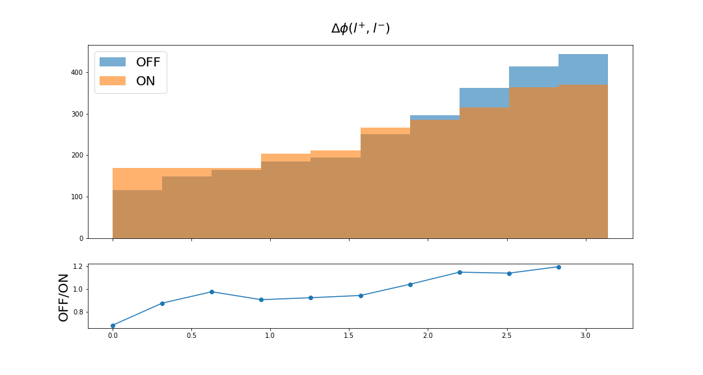

:heavy_check_mark: Number of jets peaks at 2

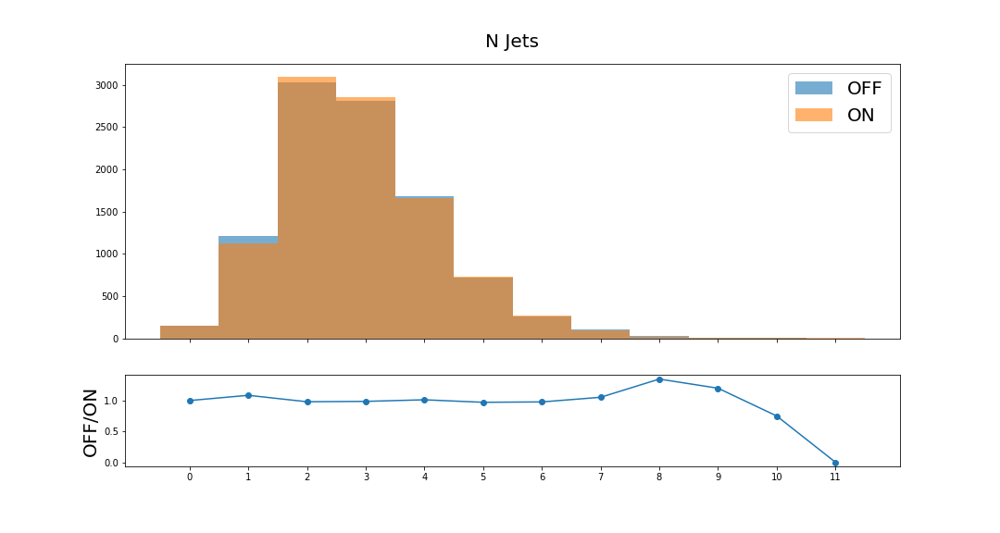
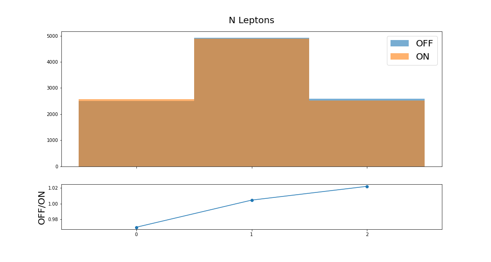

:heavy_check_mark: Mass centered around 346 GeV

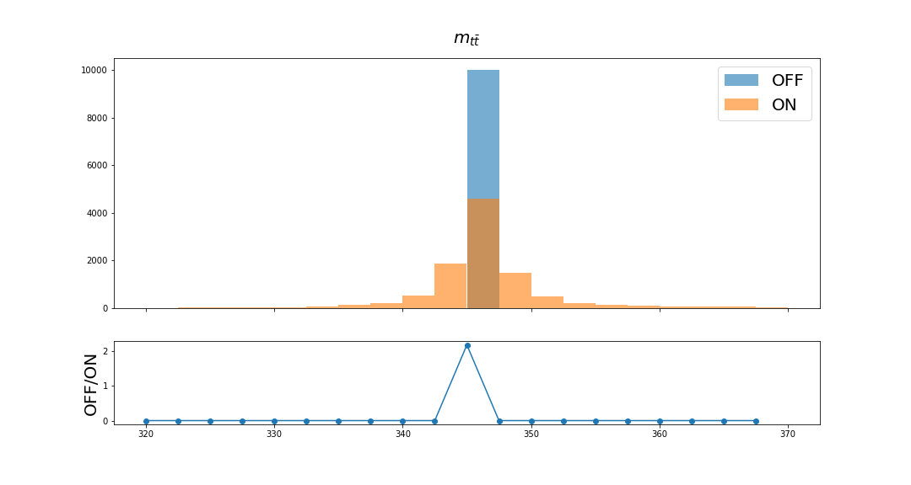
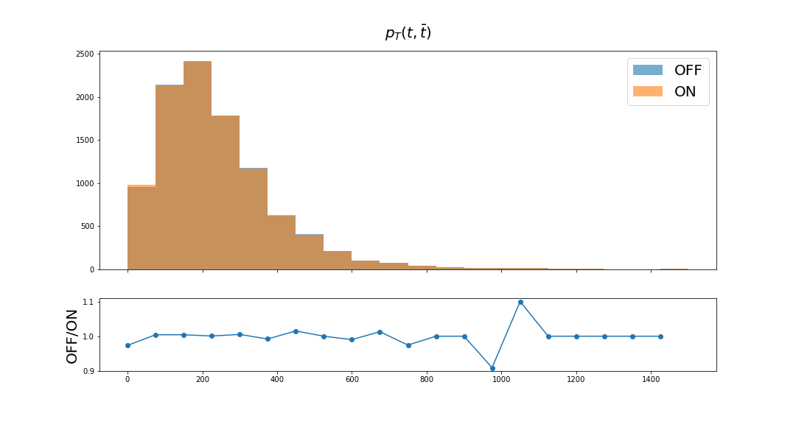

## SM vs EFT (ctG=0)

The discrepancy of the top-antitop mass is caused by the change of the [EFT implementation](https://arxiv.org/pdf/1802.07237.pdf): instead of 173 GeV they set it to 172 GeV.

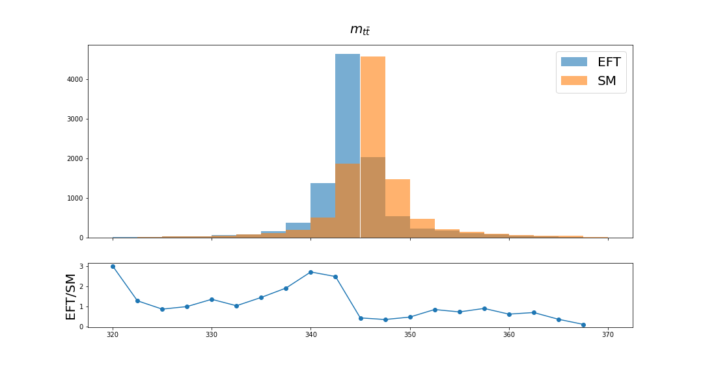

:heavy_check_mark: All plots should be the same. 

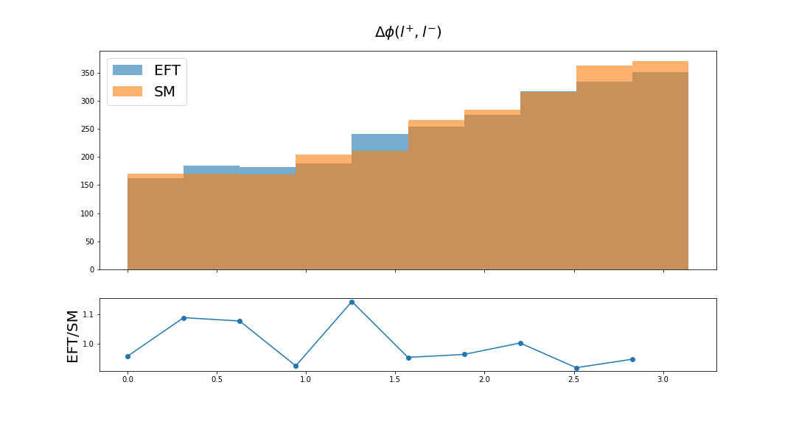

:heavy_check_mark: Number of jets peaks at 2

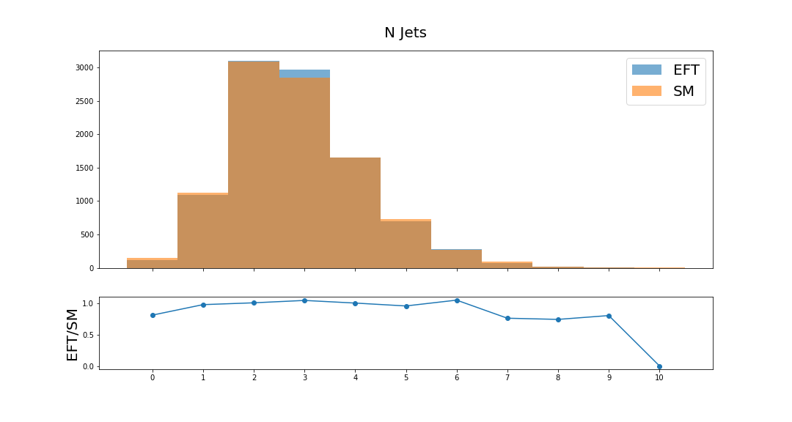
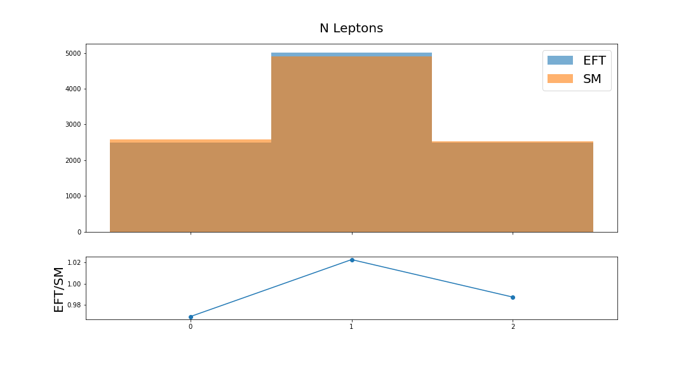

## Different Values for ctG

+ There are slight shifts in the distributions (observed better comparing ctG=0 and ctG=5).

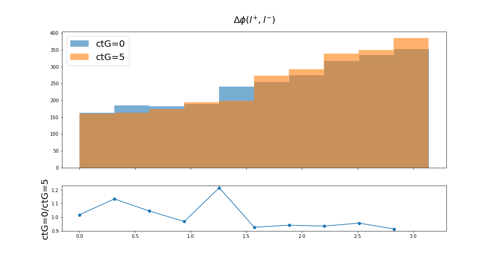
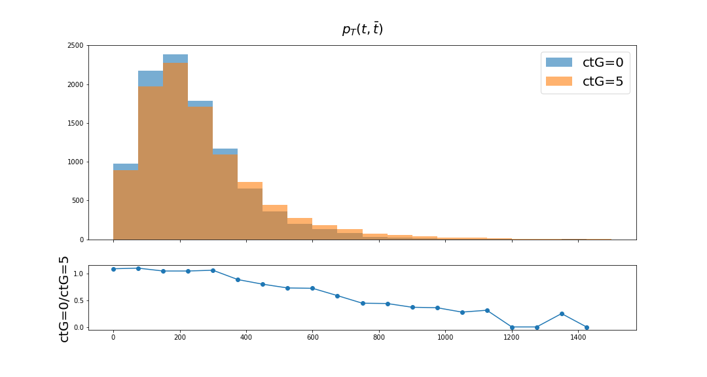

:heavy_check_mark: Number of jets peaks at 2

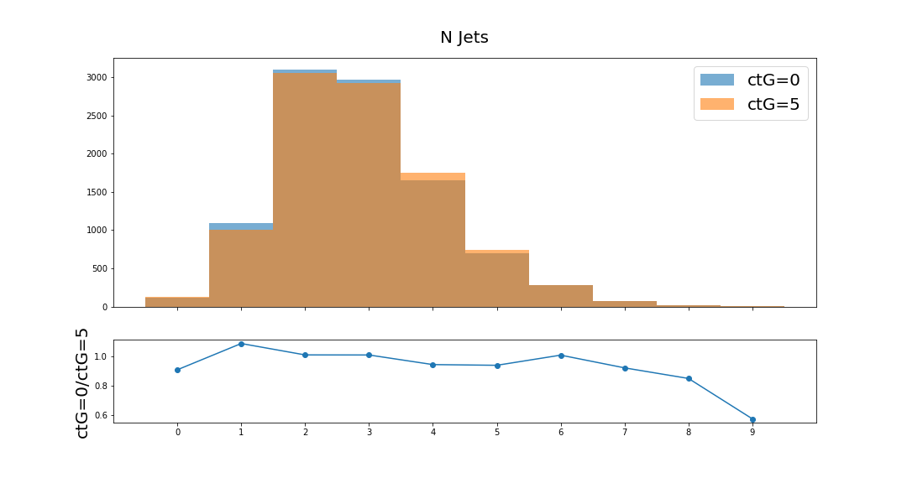

:heavy_check_mark: Mass remains consistently centered at 344 GeV

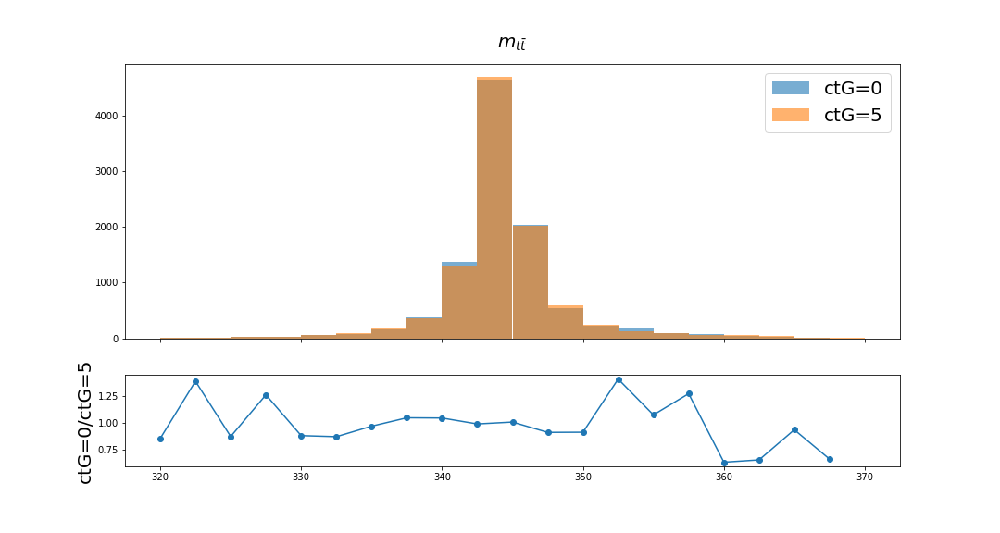
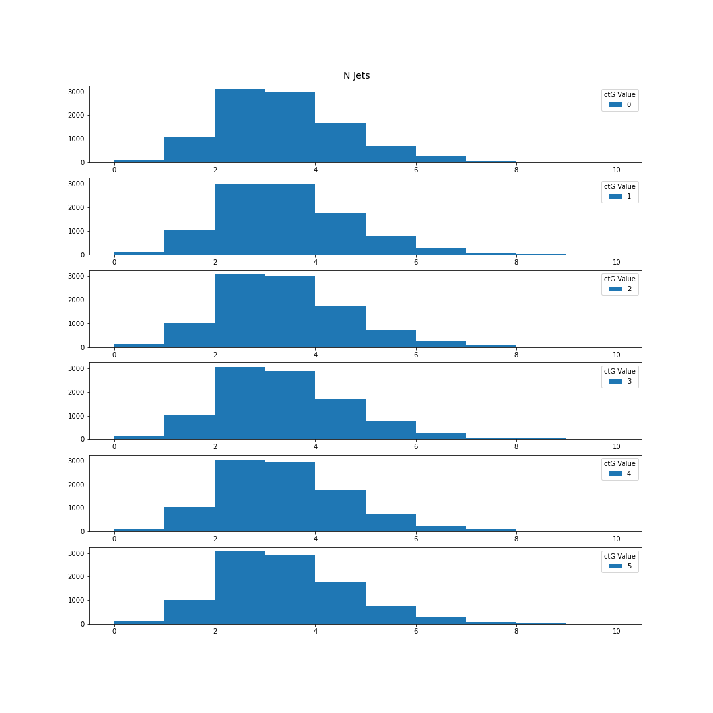
